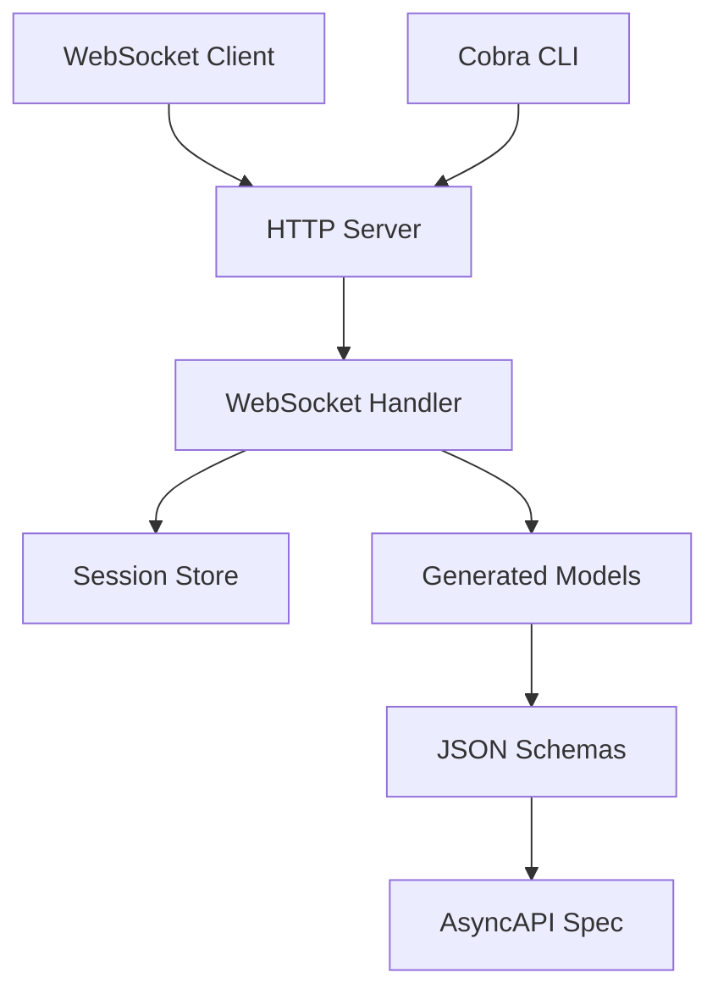

# Design Document

## Overview

Twinspeak is architected as a modular Go application that provides a drop-in replacement for Google's Gemini Live API. The system follows a layered architecture with clear separation between API specification, code generation, session management, and WebSocket handling. The design emphasizes type safety through code generation, high-performance WebSocket communication, and stateful session management.

## Architecture

The system follows a three-tier architecture:

1. **API Layer**: AsyncAPI 3.0 specification with JSON Schema message definitions
2. **Business Logic Layer**: Session management and state machine implementation
3. **Transport Layer**: HTTP server with WebSocket upgrade capability

### High-Level Component Interaction



## Components and Interfaces

### 1. API Specification Layer

**AsyncAPI Specification (`api/gemini.json`)**
- Defines WebSocket endpoint `/v1/speak`
- Specifies bidirectional message flow
- References JSON Schema message definitions

**JSON Schema Models (`api/models/gemini/*.json`)**
- Individual schema files for each message type
- Draft 2020-12 JSON Schema format
- Supports client messages: SetupRequest, ClientInputText, ClientInputAudio, ToolResult, SessionEnd
- Supports server messages: ServerOutputText, ServerOutputAudio, FunctionCall, SessionResumptionUpdate, Error

### 2. Code Generation Layer

**Model Package (`pkg/model/`)**
- Coordinates Go struct generation from JSON schemas
- Uses `atombender/go-jsonschema` for type-safe struct generation
- Generated structs support proper JSON marshaling/unmarshaling
- Maintains separation between generated and hand-written code

### 3. Session Management Layer

**Session State Machine (`pkg/session/state.go`)**
```go
type State int
const (
    StateConnecting State = iota
    StateConfigured
    StateActive
    StateClosing
    StateClosed
)
```

**Session Store (`pkg/session/session.go`)**
- Thread-safe in-memory session storage
- UUID-based session identification
- Message logging and timestamp tracking
- Session lifecycle management

### 4. Transport Layer

**HTTP Server (`srv/srv.go`)**
- Chi router for HTTP handling
- Health check endpoint
- WebSocket upgrade endpoint

**WebSocket Handler (`srv/ws.go`)**
- Message envelope pattern with type-based routing
- Session state validation
- Error handling and client communication
- Protocol compliance with Gemini Live API

### 5. CLI Interface

**Cobra CLI (`cmd/twinspeak/main.go`)**
- Command-line interface for server configuration
- Address binding configuration
- Server lifecycle management

## Data Models

### Session Data Structure
```go
type Session struct {
    ID               ID
    Model            string
    State            State
    CreatedAt        time.Time
    UpdatedAt        time.Time
    ResumptionHandle string
    Log              []any
    mu               sync.Mutex
}
```

### Message Envelope Pattern
```go
type envelope struct {
    Type string `json:"type"`
    // Additional fields passed through for specific message types
}
```

### Generated Message Types
All message types are generated from JSON schemas with proper Go struct tags for JSON marshaling. Key message types include:

- **SetupRequest**: Initial session configuration with model and optional session config
- **ClientInputText**: Text input with optional turn ID
- **ClientInputAudio**: Base64-encoded audio chunks with format specification
- **ServerOutputText**: Text responses with final flag
- **SessionResumptionUpdate**: Resumption token for session continuity
- **Error**: Structured error responses with code and message

## Error Handling

### WebSocket Error Strategy
- Structured error messages with consistent format
- Error codes for different failure scenarios:
  - `bad_json`: JSON parsing failures
  - `bad_setup`: Invalid setup request
  - `already_setup`: Duplicate setup attempts
  - `no_session`: Operations without valid session
  - `unknown_type`: Unsupported message types

### Session Error Handling
- State validation before message processing
- Graceful degradation for invalid state transitions
- Resource cleanup on connection termination

### Connection Management
- Proper WebSocket connection lifecycle management
- Context-based cancellation for graceful shutdown
- Resource cleanup on abnormal disconnection

## Testing Strategy

### Integration Testing Focus
Following the product guidelines, testing will focus on:
- Real WebSocket connection behavior
- End-to-end message flow validation
- Session state transitions
- Error condition handling

### Test Categories

**WebSocket Protocol Tests**
- Connection establishment and upgrade
- Message serialization/deserialization
- Protocol flow compliance
- Error response validation

**Session Management Tests**
- Session creation and lifecycle
- State machine transitions
- Concurrent session handling
- Session store operations

**Code Generation Tests**
- Schema validation
- Generated struct functionality
- JSON marshaling correctness

### Testing Approach
- Avoid mocks and stubs in favor of real behavior testing
- Focus on functional outcomes rather than implementation details
- Use table-driven tests for message type variations
- Integration tests with actual WebSocket connections

## Performance Considerations

### WebSocket Performance
- `gobwas/ws` library for high-performance WebSocket handling
- Minimal memory allocation in message processing
- Efficient JSON parsing with streaming where applicable

### Session Storage
- In-memory storage for low-latency access
- Thread-safe operations with minimal lock contention
- Efficient UUID-based session lookup

### Code Generation
- Build-time code generation to avoid runtime reflection
- Type-safe operations with compile-time validation
- Minimal runtime overhead for message processing

## Security Considerations

### Input Validation
- JSON schema validation for all incoming messages
- Type safety through generated structs
- Bounds checking for audio data

### Session Security
- UUID-based session identification
- Session isolation and data protection
- Proper cleanup of sensitive session data

### WebSocket Security
- Connection upgrade validation
- Message size limits (to be implemented)
- Rate limiting considerations (future enhancement)

## Deployment and Operations

### Build Process
- Makefile automation for common tasks
- Code generation as part of build process
- Single binary deployment

### Configuration
- Command-line configuration through Cobra
- Environment-based configuration (future enhancement)
- Reasonable defaults for development

### Monitoring
- Health check endpoint for load balancer integration
- Structured logging for operational visibility
- Session metrics (future enhancement)

## Future Extensibility

### Protocol Extensions
- Additional message types through schema extension
- Custom tool/function definitions
- Enhanced audio format support

### Backend Integration
- LLM provider integration
- Speech-to-text/text-to-speech services
- Function calling backend services

### Scalability
- Horizontal scaling with external session store
- Load balancing considerations
- Session resumption across instances